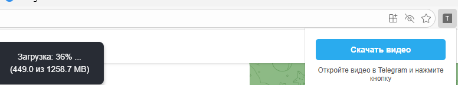

# Telegram_Video_Downloader
Браузерное расширение для извлечения и склеивания потоковых видео (HTTP 206 Partial Content) из Telegram Web.

# 📥 Telegram Web Video Downloader

**Telegram Web Video Downloader** — это легковесное расширение для браузера, которое позволяет скачивать любые видео из веб-версии Telegram (Web K / Web A), даже если в канале или чате **запрещено сохранение и пересылка контента**.

## ✨ Особенности
* 🚀 **Обход DRM-подобной защиты:** Скачивает видео напрямую из зашифрованного потока, минуя блокировки интерфейса.
* 🎥 **Оригинальное качество:** Никакого сжатия или потери кадров (в отличие от записи экрана).
* 🧩 **Умная сборка чанков:** Автоматически обходит лимиты Service Worker'а Telegram, склеивая фрагменты видео по HTTP-заголовкам `Content-Range`.
* 📊 **Удобный UI:** Всплывающий индикатор (Toast) на странице Телеграма показывает прогресс скачивания в процентах и мегабайтах.
* 🔒 **Полная приватность:** Код работает на 100% локально в вашем браузере. Не использует сторонние серверы и API.

---

## 🛠️ Как это работает (Технические детали)
В новых версиях Telegram Web ссылки на медиафайлы выглядят как зашифрованные JSON-объекты (например, `stream/{"dcId":2,"location":...}`). 
Браузер не может скачать их напрямую, так как внутренний скрипт Telegram (Service Worker) перехватывает запрос и отдает видео кусками (по 512 КБ) со статусом `206 Partial Content`. 

Попытка скачать файл через обычный `fetch` из песочницы расширения (Isolated World) приводит к ошибке `302 Redirect`. 

**Решение:**
Данное расширение инжектит скрипт-загрузчик напрямую в `MAIN world` страницы. Скрипт эмулирует работу плеера, отправляет запросы `Range: bytes=...`, читает реальный размер чанков из ответа сервера, скачивает `ArrayBuffer`'ы и склеивает их в единый `Blob`, который затем сохраняется как готовый `.mp4` файл.

 
---

## 📦 Установка (Режим разработчика)
Так как расширение пока не опубликовано в Chrome Web Store, его нужно установить вручную:

1. Скачайте этот репозиторий (кнопка **Code** -> **Download ZIP**) и распакуйте архив в удобную папку.
2. Откройте ваш браузер (Chrome, Edge, Яндекс, Brave, Opera).
3. Перейдите на страницу расширений:
   * Chrome: `chrome://extensions/`
   * Яндекс: `browser://extensions/`
   * Edge: `edge://extensions/`
4. В правом верхнем углу включите тумблер **Режим разработчика** (Developer mode).
5. Нажмите появившуюся кнопку **Загрузить распакованное расширение** (Load unpacked).
6. Выберите папку, в которую вы распаковали скачанный архив.
7. Готово! Иконка расширения появится в панели браузера.

---

## 🖥️ Использование
1. Откройте [Telegram Web](https://web.telegram.org/).
2. Найдите видео, которое хотите скачать.
3. **Обязательно:** Нажмите `Play`, чтобы видео начало воспроизводиться, ИЛИ откройте его на весь экран (чтобы скрипт понял, какое именно видео на странице вам нужно).
4. Кликните по иконке расширения в панели браузера и нажмите кнопку **«Скачать видео»**.
5. Наблюдайте за прогрессом загрузки в верхней части экрана. Когда дойдет до 100%, браузер автоматически сохранит `.mp4` файл.

---

## ⚠️ Отказ от ответственности (Disclaimer)
Данный инструмент создан исключительно в образовательных целях и для личного использования (например, для сохранения важных личных данных или лекций). Автор расширения не несет ответственности за скачивание и распространение контента, защищенного авторским правом. Уважайте труд авторов каналов.
